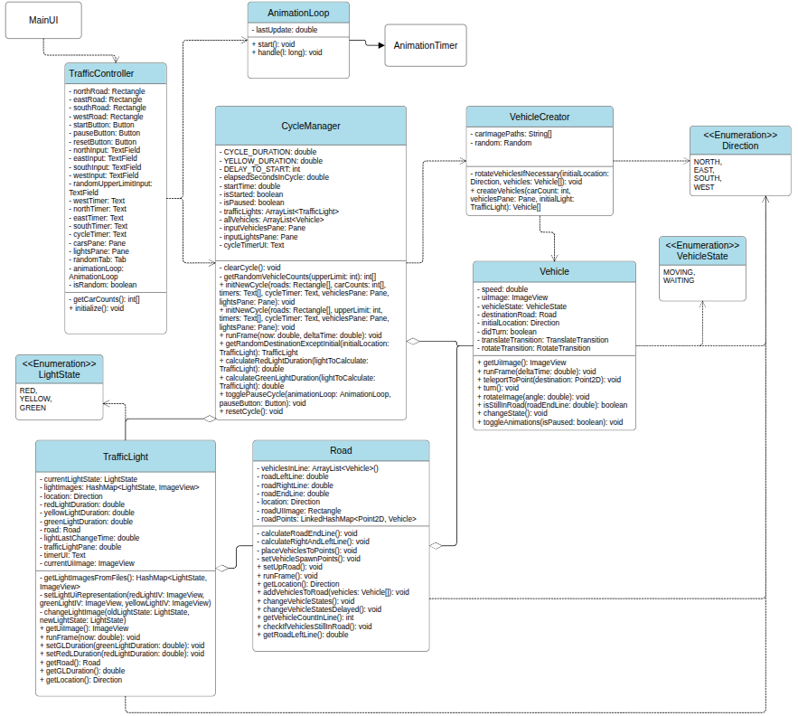

# Smart Traffic Simulation

A JavaFX-based traffic simulation system that manages traffic lights and vehicle movements at an intersection.

## Prerequisites

- Java Development Kit (JDK) 17 or later
- Maven 3.6 or later
- JavaFX 17.0.6
- Git

## Building the Project

1. Clone the repository:

```
git clone https://github.com/turkerkiv/eru-bz214-smart-traffic.git cd eru-bz214-java-smart-traffic
```

2. Build the project using **Maven** with the code below or directly in **IntelliJIdea**:

```
mvn clean install
```

## Running the Application

You can run the application using **Maven** with the code below or directly in **IntelliJIdea**:

```
mvn javafx:run
```

## Project Structure

The project is organized as follows:

- `src/main/java/com/tsmteam/erubz214javasmarttraffic/`
  - `controller/` - Contains traffic control logic
  - `enums/` - Enumerations for direction, light states, and vehicle states
  - `model/` - Core simulation models including:
    - Traffic light management
    - Vehicle movement
    - Road system
    - Animation handling
  - `resources/` - Contains image assets and FXML layouts

## Features

- Real-time traffic light management
- Vehicle movement simulation
- Dynamic traffic flow based on vehicle density
- Configurable cycle durations
- Pause/Resume functionality
- Random vehicle generation

## Technologies Used

- Java 17
- JavaFX for GUI
- Maven for project management
- FXML for layout design

## Configuration

The simulation parameters can be adjusted in the `CycleManager` class:

- Default cycle duration: 120 seconds
- Yellow light duration: 1 second
- Initial delay: 3 seconds

## Building for Distribution

To create a distributable package:
```
mvn clean package
```
The packaged application will be available in the `target` directory.

## Contributors

- Türker Kıvılcım - [github](https://github.com/turkerkiv)
- Seren Kaya - [github](https://github.com/SerenK00)
- Furkan Mete Çalış - [github](https://github.com/metecalis)

## UML Class diagram

